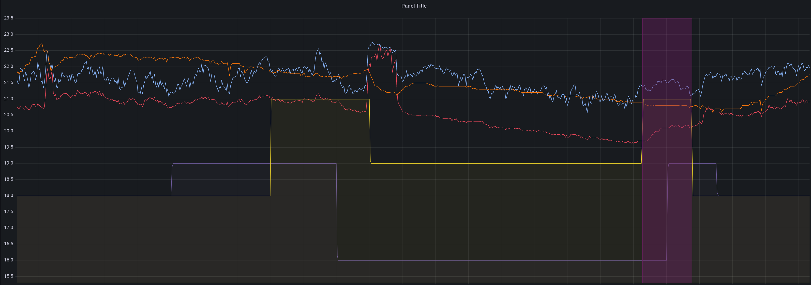

## neohub-mqtt

This application will poll a [heatmiser neostat smart heating hub](https://www.heatmiser.com/en/neohub-smart-control/),
and output temperature and heat information to an [MQTT](https://mqtt.org/) broker of your choice.

From there, you can ingest the data to e.g. [Home Assistant](https://www.home-assistant.io/)
or [InfluxDB](https://www.influxdata.com/), and store and view graphs Your Way:




### Installation

```bash
cargo build --release
sudo cp -ar target/release/neohub-mqtt /usr/local/bin/
```

You must set some environment variables:
 * where to read from, see the [`neohub` crate docs](https://github.com/FauxFaux/neohub#usage), and
 * where to write to, currently only a host IP is supported.

e.g.
```bash
MQTT_HOST=192.168.4.20
NEOHUB_URL=wss://192.168.13.37:4243
NEOHUB_TOKEN=69696969-6969-4969-6969-696969696969
RUST_LOG=info
```

It should, on startup, log (within a second or two):
```
neohub_mqtt > found hub with id "01:90:60:C0:0C:C0"
neohub_mqtt > mqtt broker acknowledged a publication (we're all good)
```

...and nothing else, at the default log level.


### Operating

 * If there is an error reading from the hub, the application will exit.
   It expects to be restarted by the supervisor, e.g. systemd.

 * If there is an error writing to the broker, the application will buffer
   events in memory for "minutes". That is, short outages of the broker will
   be tolerated, so long as there are no other errors at the same time.

 * During an exit, such as is initiated by a hub error, the application will
   make some effort to flush events to the broker.


### Example stack

 * This app, `neohub-mqtt`,
    * running as a [systemd service](docs/neohub-mqtt.service) on a machine near the hub,
    * configured with environment variables inside the systemd service config,
 * writing to [mosquitto](https://mosquitto.org/), 
   * installed from [Ubuntu](https://packages.ubuntu.com/mosquitto),
   * with no config
 * being read by [telegraf](https://www.influxdata.com/time-series-platform/telegraf/),
   * installed from [influx' apt repo](https://docs.influxdata.com/influxdb/v1.8/introduction/install/),
   * configured to [read from moquitto](docs/telegraf.d.neohub.toml) and [write to influxdb](docs/telegraf.d.influx.toml),
 * feeding [influxdb v2](https://www.influxdata.com/get-influxdb/),
   * installed from telegraf's apt repo (which, despite what the page says, does support influxdb v2),
   * with an API key (for telegraph), an API key (for grafana), and a bucket (for both) configured in the UI,
 * being read by [grafana](https://grafana.com/),
   * installed from [grafana's apt repo](https://grafana.com/docs/grafana/latest/setup-grafana/installation/debian/),
   * with an Influx FLUX datasource configured and an [overview panel](docs/grafana-panel.json).


### Example queries

The temperature in every zone:
```influx
from(bucket: "house")
  |> range(start: v.timeRangeStart, stop: v.timeRangeStop)
  |> filter(fn: (r) => r["_measurement"] == "neohub")
  |> filter(fn: (r) => r["_field"] == "temp")
  |> keep(columns:["_field", "_value", "zone_name", "_measurement", "_time"])
  |> aggregateWindow(every: v.windowPeriod, fn: mean, createEmpty: false)
  |> yield(name: "mean")
```

The set temp in every zone except "Hot Water", which doesn't have a (sane) set temp:
```influx
from(bucket: "house")
  |> range(start: v.timeRangeStart, stop: v.timeRangeStop)
  |> filter(fn: (r) => r["_measurement"] == "neohub")
  |> filter(fn: (r) => r["_field"] == "temp_set")
  |> filter(fn: (r) => r["zone_name"] != "Hot Water")
  |> keep(columns:["_field", "_value", "zone_name", "_measurement", "_time"])
  |> aggregateWindow(every: v.windowPeriod, fn: mean, createEmpty: false)
  |> yield(name: "mean")
```

Whether the zone is calling for heat:
```influx
from(bucket: "house")
  |> range(start: v.timeRangeStart, stop: v.timeRangeStop)
  |> filter(fn: (r) => r["_measurement"] == "neohub")
  |> filter(fn: (r) => r["_field"] == "heat_on")
  |> filter(fn: (r) => r["zone_name"] != "Hot Water")
  |> keep(columns:["_field", "_value", "zone_name", "_measurement", "_time"])
  |> aggregateWindow(every: v.windowPeriod, fn: last, createEmpty: false)
  |> yield(name: "last")
```

